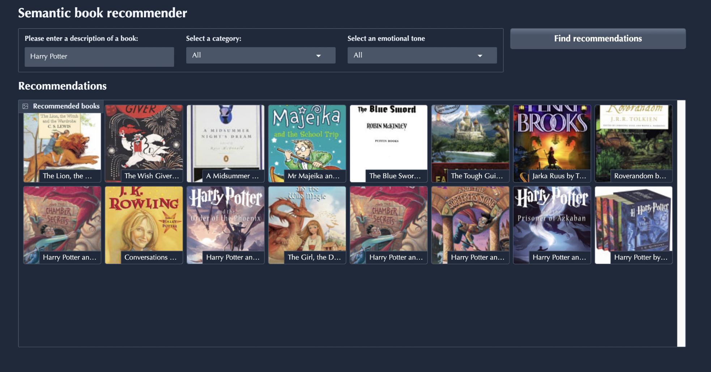

# 📚 Book Recommender

<p align="center">
  
</p>

A machine learning project that recommends books using vector search, text classification, and sentiment analysis, adapted to work as a Python package. Built by following [LLM Course – Build a Semantic Book Recommender (Python, OpenAI, LangChain, Gradio)](https://www.youtube.com/watch?v=Q7mS1VHm3Yw). 

---

## 🚀 Features
- **Data Exploration** (`01_data_exploration.ipynb`)
- **Vector Search for Recommendations** (`02_vector_search.ipynb`)
- **Text Classification of Genres** (`03_text_classification.ipynb`)
- **Sentiment Analysis** (`04_sentiment_analysis.ipynb`)
- **Interactive Dashboard with Gradio** (`gradio-dashboard.py`)

---

## 🔧 Installation
Clone the repository and install dependencies:

```bash
git clone https://github.com/yourusername/book-recommender.git
cd book-recommender
pip install -r requirements.txt
```

## ▶️ Usage
Run the Gradio dashboard:

```bash
python gradio-dashboard.py
```


## 📚 Book Recommender  

The book-recommender project is licensed under the **MIT License** – see the [LICENSE](LICENSE) file for details.
